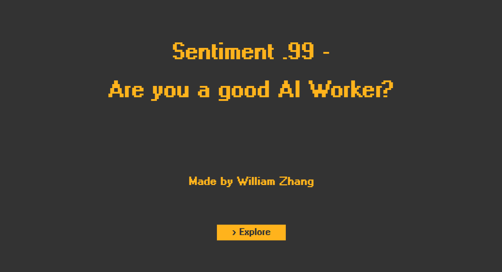
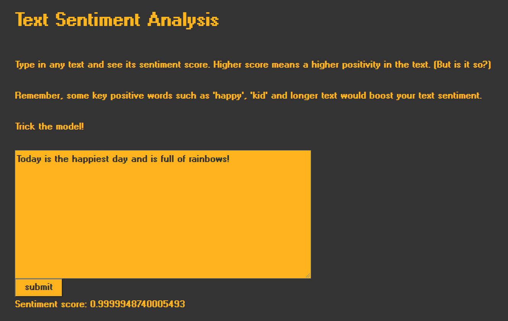

# Sentiment .99 - Are You a Good AI Worker?
## A.rt I.ntel Final Project

Created by William Zhang [cz1627@nyu.edu](cz1627@nyu.edu)
### Project Link: https://mstxy.github.io/Sentiment.99/

### Abstract
This project is built using p5.js, ml5.js and TensorFlow.js and it addresses two topics: text sentiment analysis and data annotation. It uses the dataset ETHICS introduced by Hendrycks et al. in [Aligning AI With Shared Human Values](https://github.com/hendrycks/ethics). And through looking at those texts in the dataset that were given 0.99 sentiment scores, almost a perfect score regarding sentiment, it is concluded that SENTIMENT DOES NOT MEAN EVERYTHING. By putting the user in the shoes of a data labeler, user are asked to go through a subset of 15 samples from the processed dataset and they are forced answer in voice: "yes" or "no", corresponding to whether each sentence that pops up on the screen is ethical or not. It not only wants to give an immersive experience of interactive with the datasets, but also points out the various issues hidden behind the AI data preparation. All in all, it wishes to **open up the "black box" of AI** for the user to take a peek into certain issues.

[1. Inspriation](#1-inspiration)

[2. Issues in Text Sentiment Analysis](#2-issues-in-text-sentiment-analysis)

[3. Issues in Data Annotation](#3-issues-in-data-annotation)

[4. Technology](#4-technology)

[5. Design](#5-design)

[6. Reflection & Future Developments](#6-reflection--future-developments)
  

### 1. Inspiration
The very first idea of this project comes from my wanting to continue addressing certain AI deficits. Then when experimenting with different ml5.js models, I found that the sentiment analysis is not at all accurate. It is good for dealing with short text or text with vey clear sentiment polarity. But with a lot of longer and more complicated texts I entered, the sentiment score begins to converge towards 0.99. So I decided to use that as a starting point and work with mainly text in this project. 

Another inspiration comes from [Ask Delphi](https://delphi.allenai.org/), which model people’s moral judgments on a variety of everyday situations and users could enter a situation for the AI to "ponder on" and give the result of whether it is ethical or not. Its early deployment version does not work so well, as reported in a lot of [news articles](https://www.theverge.com/2021/10/20/22734215/ai-ask-delphi-moral-ethical-judgement-demo). One example is, as long as you add "if that makes everyone happy" after a situation, Delphi will approve that, even though the situation is "killing somebody". It is really interesting to think how the AI naively process the sentences prompted, and that makes me wonder on which datasets is it being trained on. And that's how I found the dataset [ETHICS](https://github.com/hendrycks/ethics) and incorporate it into my project.

Finally, another AI issue I kept thinking of is the infrastructure behind AI: energy consumption, server storage, and manual data labeling process. While the other topics seems a little bit hard to address on in this project, the idea of AI taking away basic jobs and giving back a even worse job - data labeling could fit well into my project. Because I found the individual datapoints in the ETHICS dataset quite interesting to look at and think about, I think it would be interesting to let the user also look into the data (as the role of a data annotator), and see how different they may answer compare to the "ground-truth label" (which is also given by data annotators). The idea of using voice to give the data label comes from the 2018 award-winning documentary [*The Cleaners*](https://www.imdb.com/title/tt7689936/), where in several scenes the internet cleaners speak out "Delete" or "Do not delete", though they are actually clicking on the interfaces. By speaking it out, it sort of empahsize on my point that data annotation is boring, mind-numbing and even a bit dark, regarding its under-the-hood, exploitative and low-payment nature.

### 2. Issues in Text Sentiment Analysis
Sentiment analysis is the process of studying people’s opinions and emotions, generally using language clues. ML5.js's sentiment model is a pre-trained model trained on IMDB reviews to detect whether the sentiment of text is positive or negative.

The sentiment analysis result is a score between 0 and 1, with 0 being negative and 1 being positive. For example:

* Score 0.999: *Today is the happiest day and is full of rainbows!*

* Score 0.001: *This show is actually so bad and depressing to watch.*

Sentiment analysis, due to its (alleged) simple nature and efficiency, has been widely used, for example, in recommender systems on reviews and feedbacks. More generally, sentiment analysis is used to categorize and filter texts.

However, **are sentiment analysis accurate?**

There are, indeed, some pitfalls on the general sentiment analysis problem, where the sentiment analyzer may fail to give accurate results.

* Irony and sarcasm
* Types of negations
* Word ambiguity
* Multipolarity
The problem Irony and sarcasm is easy to understand, as sometimes even human cannot identify the sarcasm. For nagation, negation can be implicitly expressed without prefixes such as "non-", "dis-", and without "not". As for ambiguity, one word could have different meanings in different context. Take "unpredictable" as an example, a person being unpredictable and a story being unpredictable is totally different in sentiment. Moreover, in real-life texts, a sentence tends to be various in length, and it’s common that within a piece of text, some subjects will be criticized and some praised, generating multipolarity and making it hard for sentiment models to analyze the true sentiment behind the text.

Of course these problems are critical to determine the success of a sentiment model, but a more important question is:

**Can text sentiment wholly represent the characteristics of a sentence?**

The answer is probably NO, right? It is just like classifying people's credit base on their wealth, which is definitely partial and biased. Bias on people-related task are more addressed, whilst bias in text classifying is far less touched. And who knows what services we are using today are actually classifying text using only sentiment.

### 3. Issues in Data Annotation
With AI being seemingly omnipotent and autonomous, it needed large amount of human curated input to actually understand the task and give meaningful results. Among these human labor, the most important is data annotation.

Data annotation is the process of labeling the data available in various formats like text, video or images. For supervised machine learning, labeled data sets are required, so that machine can easily and clearly understand the input patterns.

While we would expect the dataset to be annotated by 'researchers', in most cases it is actually not: they are being annotated by third-world workers and unemployeed people via sites such as CrowdFlower, Clickworker, Toluna, and Amazon’s Mechanical Turk. They complete mind-numbing tasks for hours on end, sometimes earning just pennies per job. A recent Mechanical Turk listing, for example, offered workers 80 cents to read a restaurant review and then answer a survey about their impressions of it; the time limit was 45 minutes.

Working as a data labeler/annotator, you are forced to work fast for just these poorly-paid wages. And all that comes out of your labelling interface, go into the AI training and propagates as AI algorithms in the use.

### 4. Technology
#### 4.1 Text Sentiment Analysis
The first tool is ML5.js's [sentiment model](https://learn.ml5js.org/#/reference/sentiment), I use JavaScript to read the csv's in the dataset, and run the sentiment model in p5.js's setup function, and select those text having a sentiment score higher than 0.99 (which is far more than I had expected!) and try to store them in JSON format, which is easier for future usage. I also write the calculated sentiment score in the JSON to avoid future repetitive work. However, JavaScript does not have the ability to write to files, and the only solution will be using node.js / npm packages (which I am not at all familiar of using). So I took the alternative, set the compiled JSON to a p element in the HTML and directly copy the innerHTML to the .json file I created. Because JSON does not need indentation to work and my dataset is not that big, this approach worked well.
Because this project is based on text and users should have a more thorough understanding of how text sentiment works, at the end of this project I add a page for the user to experiment with the ml5.js sentiment model. And the interesting discovery is that, once I set the default value of the input sentence to be "Today is the happiest day and is full of rainbows!", even adding negative sentences after that will still make this sentence receiving a highly positive sentiment score.
Link to the text sentiment analysis page: https://mstxy.github.io/Sentiment.99/sentiment/

#### 4.2 Universal Sentence Encoder
Because this project aims at opening the "black box" of AI, throught certain aspects. I want to not only give the user an empirical experience about how different text sentiment and what the text is actually saying, but also reveal to the user, how exactly is machine seeing these sentences. Therefore, I use TensorFlow.js's [Universal Sentence Encoder (USE)](https://github.com/tensorflow/tfjs-models/tree/master/universal-sentence-encoder) to encode each of the sentences (15 sentences) appeared in the data annotation process. What USE does is embed the prompted sentence into a vector of length 512. And I transformed that vector in to a 32\*16 matrix, just to make it look more compact. All ml5.js / tf.js's text related task are sort of based on this embedded result. So by showing the embedded result, as well as the corresponding ethics label, sentiment and actual sentence, users are able to compare between them, and see that though the sentence are all given 0.99 sentiment scores, they are actually very different.

#### 4.3 Sound Classifier
As mentioned in the inspiration section, I want to use voice to control the labeling process to emphasize on the boring, mind-numbing feature of data annotation. The tool I refer to is ml5.js's [Sound Classifier](https://learn.ml5js.org/#/reference/sound-classifier). It is quite straight forward, it provides sound classification of the ten digits from "zero" to "nine", "up", "down", "left", "right", "go", "stop", "yes", "no". All I need to do is to filter the results and make the code only reacts to "yes" and "no".

### 5. Design
The overall design only uses two major colors: #ffb31c (as the text color) and #333333 (as the background color). It aims to follow a minimal design, with the orange text color sort of want to give users a hint on Amazon's feature color. Also, the font chosen is [Levi Adobe Dia](https://www.1001fonts.com/levi-adobe-dia-font.html) aiming to present a retro, old-computer style. This is partly because the Amazon MTurk interface is sort of old-fashioned, lack of design, and is just basic html to some sense, which appears to me a even more exploitation and ignorance towards its workers, and this project wants to also mention on that. I also added a webcam capture to the side of the interface, currently it has no other features. It is designed to present a sense a surveillance towards the data annotators, showing even worse treatment towards them.

### 6. Reflection & Future Developments
Overall, I am satisfied with this project. I tried to incorporate a lot of ideas into this one project, and in the end all pieces up together. It is also aimed to do something very different from my previous projects and also others' projects, both from the techniques used as well as the topics I am focusing on.

For future developments, the first thing is that the webcam capture currently have not practical meaning. I actually want to incorporate TensorFlow.js's [face-api](https://github.com/justadudewhohacks/face-api.js/blob/master/README.md) into it, so that by the end of the data annotation, it will show you what expressions you have during the whole process. A further invasion of personal rights.
Also, allowing the user to choose different question numbers will be more user-friendly. So that users with different purposes, for example, user only want to experience the studd and user want to explore the dataset, could have different number of questions.
Lastly, thought already enough, the tools found on the internet that does machine learning on text-related tasks are still limited. I would be willing to discover more text-realted tools hidden and see how I could utilize them also in my project.
